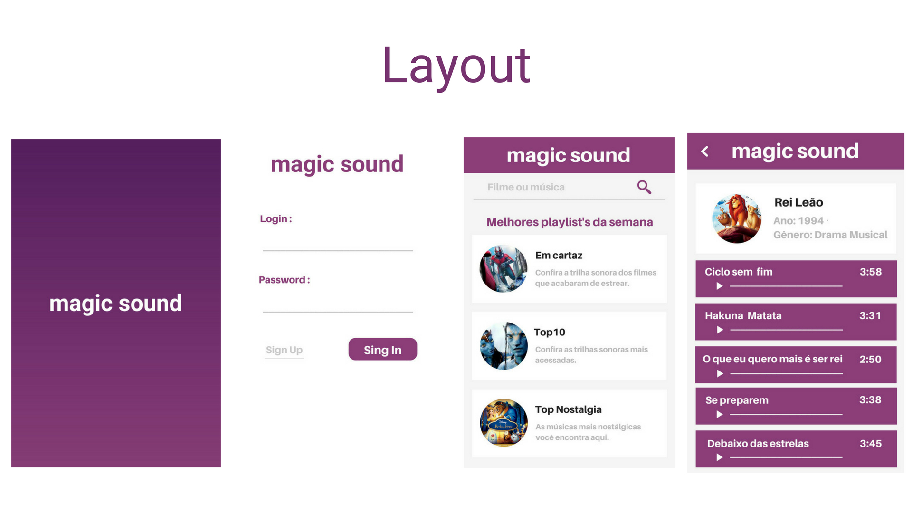
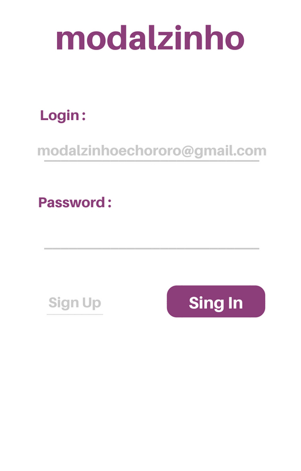
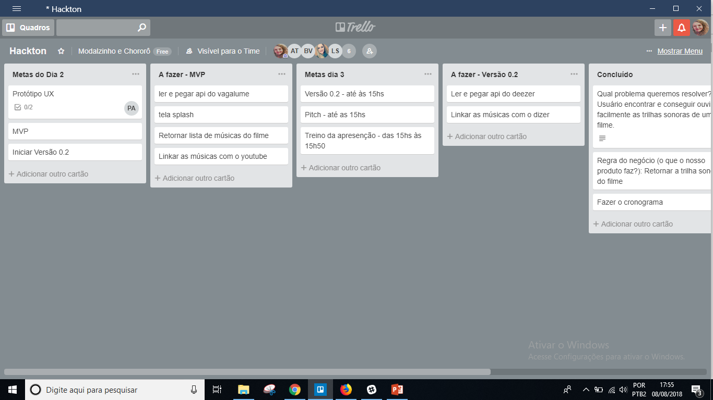
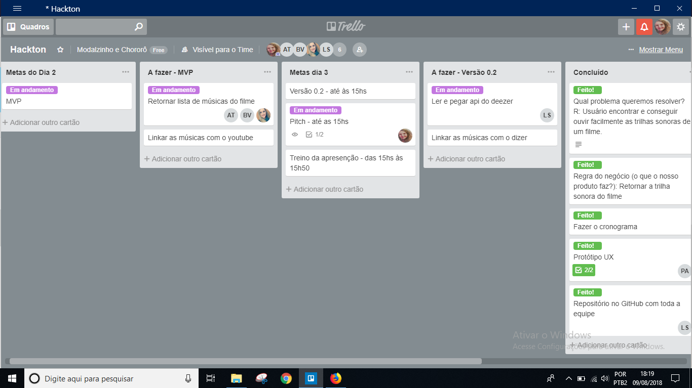

O objetivo do trabalho seria encontrar e ouvir facilmente trilhas sonoras de filmes.
A regra do negocio é retornar a trilha sonora do filme.

link do Protótipo Navegavel (MarvelApp) https://marvelapp.com/33ff992

##Prototipo :
Este foi o prototipo atraves do canvas

<!-- 

 -->

##Cronograma :
Este foi o cronograma atraves do trello 
08/08 
09/08-inicio 
09/08-fim 
<!-- 10/08  -->